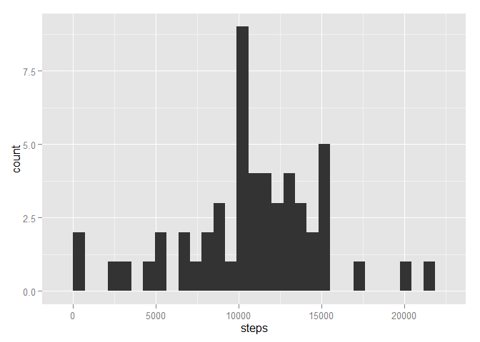

# Reproducible Research: Peer Assessment 1

## Loading and preprocessing the data


```r
unzip("activity.zip")
data <- read.csv("activity.csv")
data[,2] <- as.Date(data[,2], format = "%Y-%m-%d")
```


## What is mean total number of steps taken per day?


```r
totalstep <- aggregate(steps ~ date, data=data, sum)
library(ggplot2)
qplot(steps, data=totalstep, geom="histogram")
```

```
## stat_bin: binwidth defaulted to range/30. Use 'binwidth = x' to adjust this.
```

 

```r
meantotalstep <- mean(totalstep$steps)
meantotalstep 
```

```
## [1] 10766.19
```

```r
medtotalstep <- median(totalstep$steps)
medtotalstep
```

```
## [1] 10765
```


## What is the average daily activity pattern?


## Imputing missing values


## Are there differences in activity patterns between weekdays and weekends?


